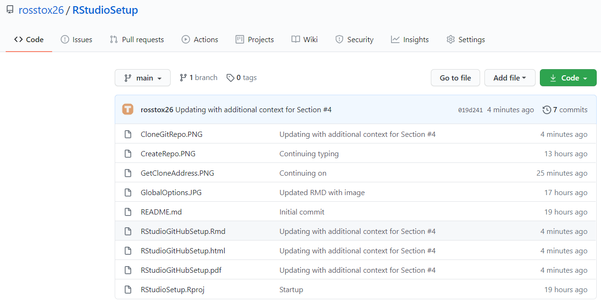

```{r setup, include=FALSE}
knitr::opts_chunk$set(echo = TRUE)
```

# RStudio + GitHub

So let's say that you have to work on a group project for your data analytics class. You have a dataset for the project - and you are going to write a project report as a RMarkdown file and build data analysis models using R. The problem - you need to do this collaboratively as a team of five, globally distributed, across time zones, students.

Clearly, each student working independently and then merging code/files together is sub-optimal. You are bound to repeat things, do stuff that will not match other students, have different approaches that may not merge well and so on. Sharing files over email, google drive etc just introduces needless complexity. What you need to do is what software development teams all over the world so - collaborate over a cloud based versioning and remote collaboration plaforms like GitHub.

> This is your absolutely bare-bones, just enough to get you started, beginners guide to how to collaborate on R based group projects using RStudio and GitHub.

# Let's Begin with the Building Blocks

Let's get the basic out of the way:

- You have installed R. If not, you can get it from here: https://cran.rstudio.com/.
- You have installed RStudio. If not, you can get it from here: https://rstudio.com/products/rstudio/download/. Go for the free, Desktop version.
- You have installed Git in your machine. If not, get the download for your operating system here: https://git-scm.com/downloads. You can install git with all the default options. We will use git only through the RStudio GUI so most of the options are not relevant for us.
- You have created an account on GitHub.com. If not, go create one here: https://github.com/join

Alright - now you are ready.

## Configure RStudio for Git/GitHub

We need to make sure that our RStudio session is set up to work with Git/GitHub. Go to Tools > Global Options > Git/SVN. Ensure that:

- Option `Enable version control interface for RStudio Projects` is **checked**.
- Git Executable is showing the path to the your installed Git.
- SVN and RSA options are not relevant for us - you can ignore those.

In my RStudio session, the dialog box looks like the following:


{width=40%}

# Easiest Path to a GitHub + RStudio Integration

It is important to note that RStudio's Git/GitHub functionality is tied to the idea of a "RStudio Project". Each project is a self contained unit that lives in a specific folder. The project folder has a git repository that can be synced with a cloud based remote repository. The easiet path to creating a RStudio Project that is synced with GitHub is follow the step by step process explained below.

## Create an Empty Repository in GitHub

Sign into GitHub and click the button for creating a new repository. The screen should look like the image below:


{width=50%}


- Provide a repository name. I am using the name `TestRepo` in the example image above
- Choose either `Public` or `Private` as your repository's access level. If you are unsure, choose `Public`
- Choose the option for `Add a Readme File` so that you have some material in your repo and its not *completely* empty

## Clone the Repository in RStudio

Once your repository is creted, you can click the button named `Code` to reveal the needed information for cloning the repository to your RStudio. We will use HTTPS as our cloning mechanism. Copy the HTTPS address shown.

{width=70%}

Now we need to use the HTTPS cloning address in RStudio. Click File > New Project > Version Control > Git. This will get you to the dialog box shown below.

{width=40%}

Paste the HTTPS clone address into the Repository URL field. It is best to not change the Project Directory Name - it will be same as the GitHub repo name by default. You can of course choose the location in your local file structure where you want to save the project via the Browse button. It is also preferable to check the Open in a New Session Option. That's it - now click the Create Project button. RStudio will create your project and download all the content from GitHub.

# Working in RStudio with Git/GitHub Integration

Now that you have a Project with Git/GitHub integration, you should have a Git tab available to you in RStudio. There are three buttons of importance and immediate use for you: `Commit`, Down Arror (or `Pull`) and Up Arrow (or `Push`).

Pull functionality is the easiest. When you click that button, RStudio will download the current version of the GitHub Repository. Essetially, your local files will be overwritten by the content on GitHub. So, if the content at GitHub was updated since you last pulled down the repos, then those changes will not be reflected in your local files.

The Push functionality need a couple of steps. First, you need to `Commit` all the changes made into the local Git repository and then the Push button uploads the local repository into GitHUb. When you click `Commit`, you will get a list of all the files that have changed since you commited to the local Git repository last time. Select all the files that you wish to commit. You will also need to type a `Commit Message` - it is suggested that you make this message detailed and descriptive - just like a code comment. Then hit the `Commit` button. Once commit into the local Git Repository is finished, you can click the Up Arrow `Push` button to upload the changes to GitHub.

{width=60%}

That's it. You have now managed to `Push` your changes to GitHub and `Pull` the current version of GitHub Repo. Let's take a look at our GuitHub Repository after we have pushed our chages. It should reflect all the changes we have made locally.

{width=50%}

There you have it - your GitHub Repository is now updated.

## Collaborating with Your Team

Well - you can work with RStudio + Git/GitHub - but that was not the point. We wanted to build a collaboration platform. Not to worry - it is easy to allow your team access to your repository and allow them to clone your repo, make changes to your repo and push/pull as needed. You just need to add your team as `Collaborator` to your GitHub repo. 

Go to your GitHub repo page, select Settings > Manage Access > Invite a Collaborator. There you will be able to add collaborators using their GitHub username, full name or email address. People you invite will get an email invitation to join your repo - once they accept then they will have full access to your repo and they will be able to contribute to the shared repo.


# Surely There is More to This?

Yes. Unfortunately. Things with Git and GitHub tend to get too complicated too soon. You will run into issues. I am addressing the most common issues below - rest will have to wait for the next update of this document.

## EMail Address Not Matching

This is the most common issue I see my students facing. If you get an error message on these lines, then you can use the code below to fix it. Remember that this code needs to be run in the Command Line of your Operating System. Easiest way to do that is to use the `Terminal` tab in your RStudio Project - as shown below:

{width=50%}

The command typed above shown below. Of course, make sure that the email address you are using is the same as the one used in your GitHub account.
```{}
git config --global user.email "email@example.com"
```

***
